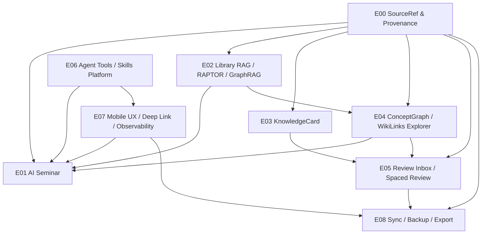

# Epic Index

> 排序依据是依赖 DAG，不是月份、季度或人日。

## 1. 依赖图

## 2. Epic 总览

| Epic | 能力 | 主要产物 | 主要 Gate |
| --- | --- | --- | --- |
| E00 | SourceRef & Provenance | 统一证据引用、AI 内容归属、source hash 策略 | Retrieval Quality, Agent Safety And Privacy, Review And Rescue |
| E01 | OpenMAIC-style AI Seminar | Reading Director、角色输出、Shared Whiteboard、Action Protocol | Mobile Resource, Agent Safety And Privacy, Retrieval Quality, Review And Rescue |
| E02 | Library RAG / RAPTOR / GraphRAG | 可执行检索能力栈、索引升级规则、RAG 质量验证 | Retrieval Quality, Mobile Resource, Review And Rescue |
| E03 | MarginNote-style KnowledgeCard | 卡片模型、候选生成、Review 写入、回跳原文 | Agent Safety And Privacy, Retrieval Quality, Review And Rescue |
| E04 | ConceptGraph / WikiLinks Explorer | 概念节点、关系边、局部探索、Concept Dossier | Retrieval Quality, Agent Safety And Privacy, Review And Rescue |
| E05 | Review Inbox / Spaced Review | 审批状态流、复习队列、回溯原文 | Agent Safety And Privacy, Sync Backup Export, Review And Rescue |
| E06 | Agent Tools / Skills Platform | 自定义 skills contract、权限矩阵、sub-agent 治理 | Agent Safety And Privacy, Mobile Resource, Review And Rescue |
| E07 | Mobile UX / Deep Link / Observability | 入口、进度、错误恢复、成本可见、deep link | Mobile Resource, Retrieval Quality, Release Promotion |
| E08 | Sync / Backup / Export | 用户资产同步、冲突 Review、导出 | Agent Safety And Privacy, Sync Backup Export, Review And Rescue, Retrieval Quality |

## 3. Ready 规则

一个 Epic 只有同时满足以下条件才进入 `Ready`：

- 上游 Epic 的必要 Capability 已 `Accepted`，或在本文中明确允许并行；不得以 `Draft` 作为可执行依赖。
- 每个 Agent Task 有 `Input Truth` 和 `Output Artifact`。
- 写明允许触碰和禁止触碰的模块。
- 写明至少一个验证命令或可观察验收。
- 写明回滚或降级策略。
- 已通过对应 `gates/` 文件中的 pre-check。

## 4. Accepted 规则

一个 Epic 只有同时满足以下条件才进入 `Accepted`：

- 所有 Capability 的 Agent Task 已完成。
- 测试、静态检查、DB 断言或 UI 验收有证据。
- 用户资产、AI draft、派生缓存的边界没有混淆。
- 独立 reviewer/rescue gate 已完成。
- 文档中无 `未来优化`、`后续完善`、`可接受` 等不可执行表达。
